# AI Smart Advisor

Projeto acadêmico desenvolvido para a disciplina **Padrões Web Para No Code e Low Code**, da graduação em **Inteligência Artificial e Automação Digital** da UniFECAF.

## Dados acadêmicos

**Universidade:** UniFECAF  
**Curso:** Graduação Tecnológica em Inteligência Artificial e Automação Digital  
**Disciplina:** Padrões Web Para No Code e Low Code  
**Aluno:** Waldir Adilson Évora dos Santos  
**RA:** 263388  

## Aplicação publicada

**Acesso público:** https://ai-smart-advisor.framer.ai

## Sobre o projeto

O **AI Smart Advisor** é uma experiência web desenvolvida para ajudar pequenas empresas a identificar qual tipo de solução digital pode fazer mais sentido para o cenário apresentado.

O usuário responde cinco perguntas sobre atividades manuais, integração entre sistemas, uso de inteligência artificial e necessidades de desenvolvimento digital. A aplicação calcula uma recomendação principal e uma solução complementar com base nas respostas.

Depois do diagnóstico, o usuário também pode escrever um pequeno contexto sobre o problema que deseja melhorar. Esse contexto é enviado para uma integração com IA generativa, que produz uma orientação complementar sem alterar o resultado calculado pelo diagnóstico.

Por fim, o usuário pode solicitar uma análise mais detalhada por meio de um formulário. Os dados enviados são registrados automaticamente em uma planilha do Google Sheets e também geram uma notificação por e-mail.

## Problema

Pequenas empresas muitas vezes sabem que precisam melhorar processos, integrar ferramentas ou utilizar inteligência artificial, mas nem sempre conseguem identificar qual caminho deve ser priorizado.

A proposta do AI Smart Advisor é oferecer uma experiência simples que ajude o usuário a organizar essa necessidade antes de solicitar contato ou uma análise mais detalhada.

## Público

O projeto foi pensado principalmente para pequenas empresas, gestores e profissionais que desejam melhorar processos de trabalho por meio de automação, integração, inteligência artificial ou soluções digitais.

## Soluções avaliadas

O diagnóstico trabalha com quatro categorias:

1. Automação de Processos
2. Integração de Sistemas
3. Soluções com Inteligência Artificial
4. Desenvolvimento de Soluções Digitais

## Como funciona

1. O usuário inicia o diagnóstico.
2. Responde cinco perguntas.
3. Cada resposta adiciona pontos a uma categoria.
4. O sistema calcula a maior pontuação.
5. A categoria com maior pontuação é apresentada como recomendação principal.
6. A segunda maior pontuação aparece como solução complementar.
7. O usuário pode escrever um contexto adicional.
8. A IA gera uma orientação personalizada com base no diagnóstico e no contexto informado.
9. O usuário pode solicitar uma análise mais detalhada pelo formulário.
10. A solicitação é registrada no Google Sheets e também gera uma notificação por e-mail.

## Tecnologias e ferramentas

### Framer

Utilizado como plataforma no-code/low-code para construção da página, organização visual, componentes, navegação, formulários, publicação e breakpoints responsivos.

### React e TypeScript

O diagnóstico foi desenvolvido como um Code Component personalizado no Framer.

O componente implementa:

- cinco perguntas interativas;
- armazenamento das respostas;
- sistema de pontuação;
- barra de progresso;
- recomendação principal;
- recomendação complementar;
- regra determinística de desempate;
- reinício do diagnóstico;
- campo de contexto para IA;
- estados de carregamento, sucesso e erro;
- integração com endpoint externo.

### DeepSeek V4.1 Flash

Utilizado para gerar uma orientação complementar com IA a partir das respostas do diagnóstico, da recomendação principal, da solução complementar e do contexto opcional escrito pelo usuário.

A IA não decide a recomendação principal. Essa decisão continua sendo calculada pelas regras do diagnóstico.

### Cloudflare Worker

Utilizado como camada intermediária segura entre o Framer e a API da DeepSeek.

A chave da API não fica exposta no navegador. Ela é armazenada como Secret no Cloudflare Worker.

O Worker também possui restrição de origem para aceitar chamadas apenas da aplicação publicada.

### Google Sheets

Utilizado para registrar automaticamente as solicitações enviadas pelo formulário.

### Automação de e-mail

O formulário do Framer também envia uma notificação por e-mail quando uma nova solicitação é registrada.

## Personalização com padrões Web

O projeto não utiliza apenas componentes visuais prontos.

A principal funcionalidade foi implementada com código personalizado em React e TypeScript, aplicando conceitos da Web como:

- componentes;
- eventos de clique;
- gerenciamento de estado;
- validação;
- lógica condicional;
- requisições HTTP;
- tratamento de respostas JSON;
- estados de carregamento e erro;
- acessibilidade;
- responsividade.

## Lógica do diagnóstico

O diagnóstico utiliza quatro categorias internas:

```text
automacao
integracao
ia
digital
```

Cada resposta pode adicionar pontos a uma dessas categorias.

Exemplo:

```text
"Muitas tarefas manuais e repetitivas"
Automação +3
```

Ao final das cinco perguntas, as categorias são ordenadas pela pontuação.

Em caso de empate, a ordem utilizada é:

```text
Automação
Integração
IA
Digital
```

As pontuações não são mostradas ao usuário.

## IA generativa

Depois do resultado, o usuário pode preencher um campo opcional com até 500 caracteres.

A aplicação envia ao backend apenas:

```json
{
  "contexto": "texto opcional do usuário",
  "respostas": ["resposta 1", "resposta 2", "resposta 3", "resposta 4", "resposta 5"],
  "recomendacao": "recomendação principal",
  "complementar": "solução complementar"
}
```

Nome, e-mail, empresa e dados do formulário de contato não são enviados para a IA.

## Segurança e privacidade

Foram adotadas algumas medidas para evitar exposição desnecessária de dados:

- a chave da DeepSeek não fica no código do Framer;
- a chave é armazenada como Secret no Cloudflare;
- o navegador chama apenas o Worker;
- o Worker aceita chamadas do domínio publicado do projeto;
- o campo de contexto da IA possui limite de 500 caracteres;
- o usuário recebe orientação para não informar senhas ou dados confidenciais;
- dados do formulário de contato não são enviados para a IA;
- o formulário possui campo de consentimento.

## Responsividade

A interface foi preparada para três faixas principais:

```text
Desktop: 1200px ou mais
Tablet: 810px até 1199px
Phone: até 809px
```

No celular, os cards e campos são organizados verticalmente e os controles principais possuem área mínima de toque adequada.

## Acessibilidade

Foram aplicados cuidados como:

- labels visíveis nos campos;
- botões semânticos;
- foco visível;
- contraste entre texto e fundo;
- área mínima de toque nos controles principais;
- `aria-live` para mudanças dinâmicas do diagnóstico;
- mensagens de carregamento, sucesso e erro;
- navegação por teclado nos controles do diagnóstico.

## Formulário e integração

Depois do diagnóstico, o usuário pode clicar em **Solicitar uma análise**.

O formulário possui:

- Nome
- E-mail
- Empresa
- Área de interesse
- Mensagem
- Consentimento

A origem da solicitação também é enviada por um campo oculto com o valor:

```text
AI Smart Advisor
```

Após o envio:

1. a solicitação é registrada no Google Sheets;
2. uma notificação por e-mail é enviada;
3. o usuário recebe confirmação de envio na interface.

## Estrutura da página

```text
Header
Hero
Como funciona
Soluções
AI Smart Advisor
Contato
Footer
```

## Evidências

### Página inicial no desktop

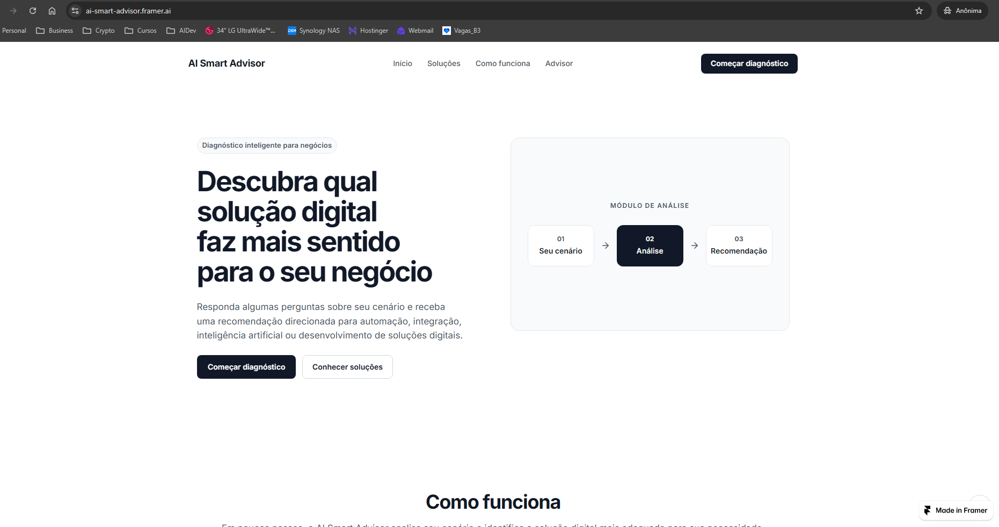

### Página inicial no celular

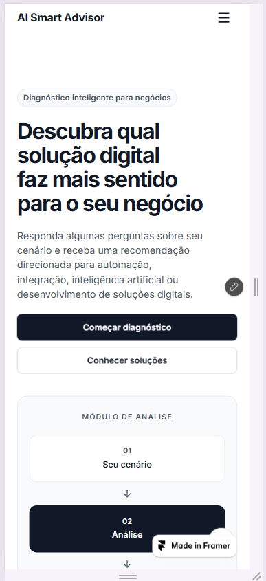

### Diagnóstico em andamento

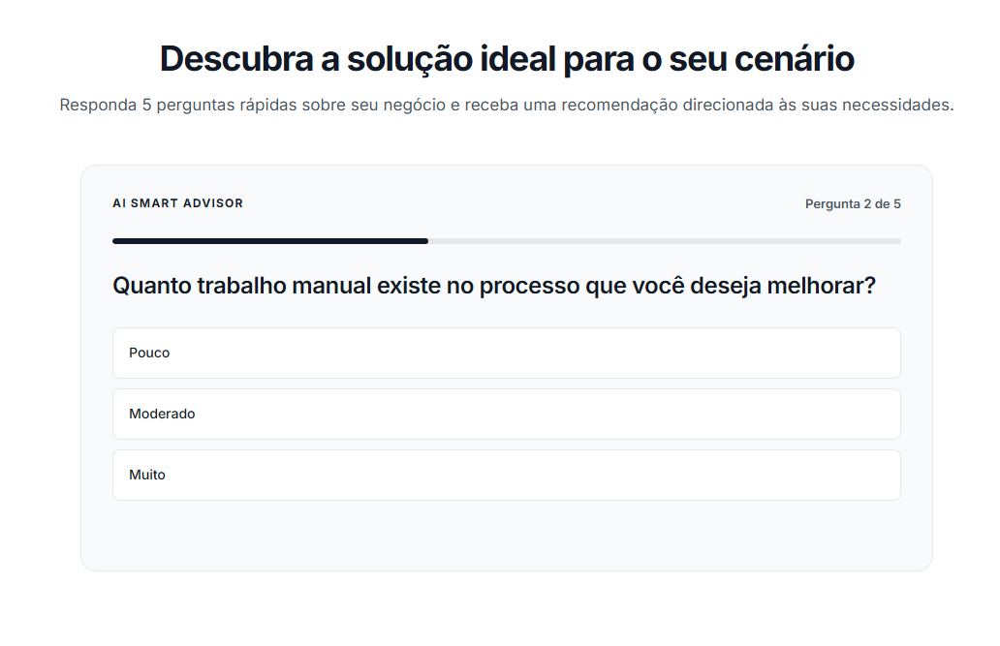

### Resultado e análise personalizada com IA

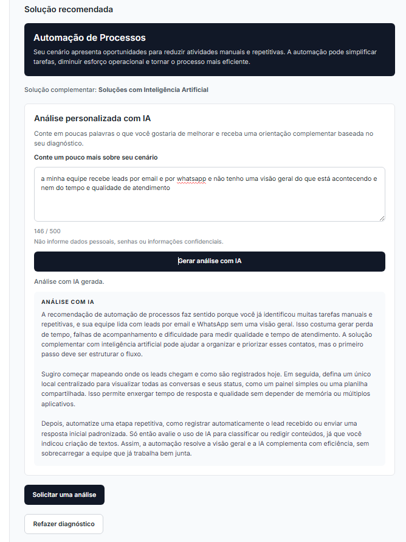

### Formulário enviado com sucesso

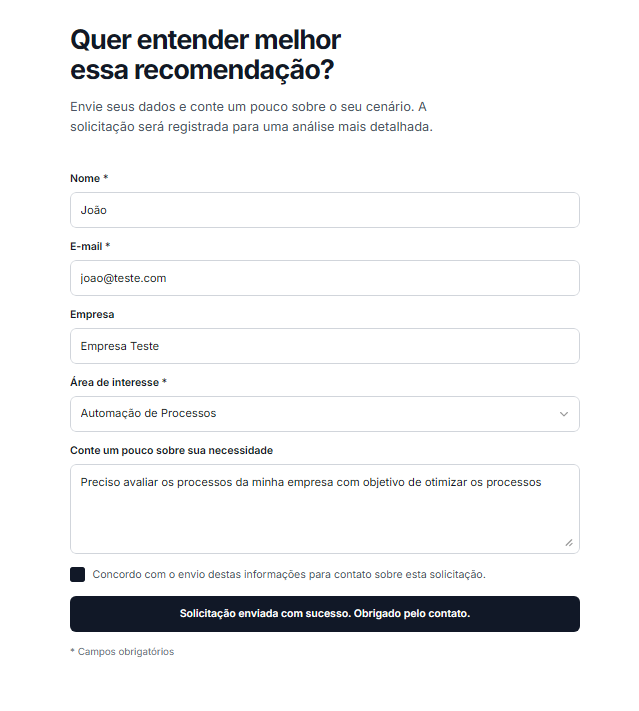

### Integração com Google Sheets

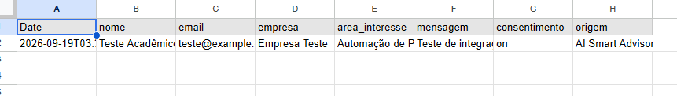

### Notificação por e-mail

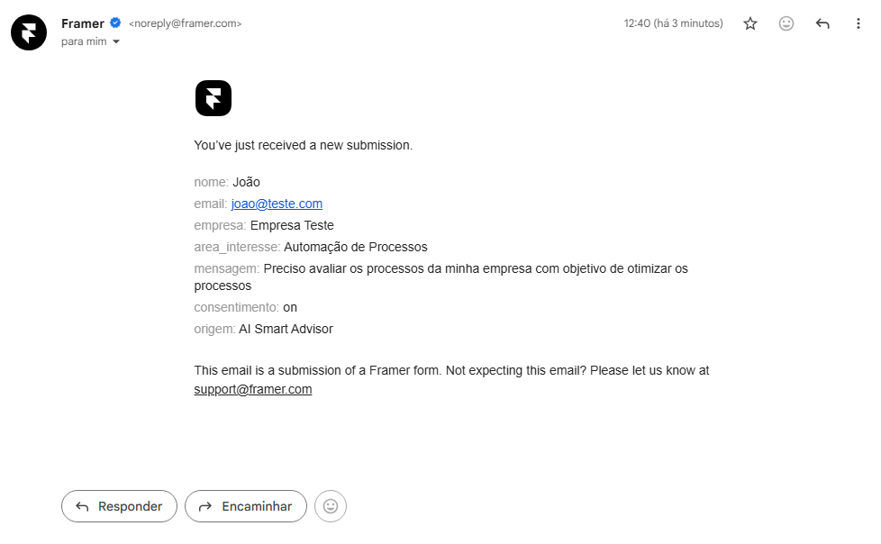

### Breakpoints no Framer

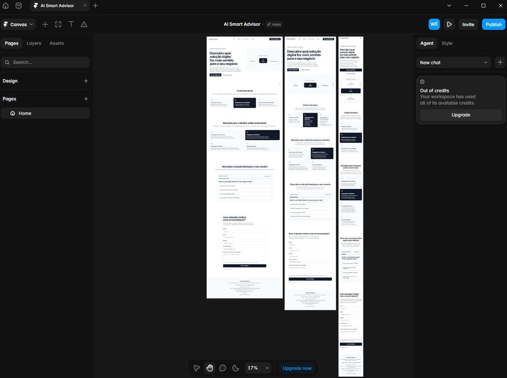

### Cloudflare Worker

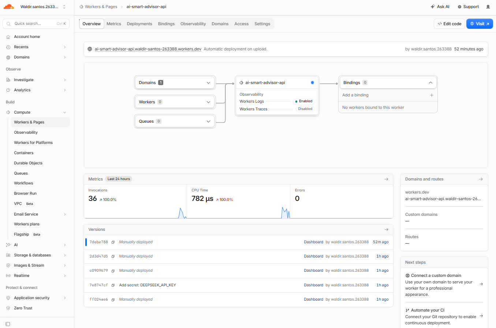

### Secret protegido no Cloudflare

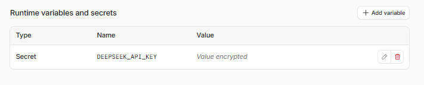

### Footer com informações acadêmicas

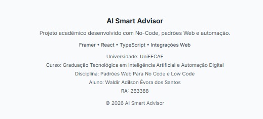

### Backup do projeto no Framer

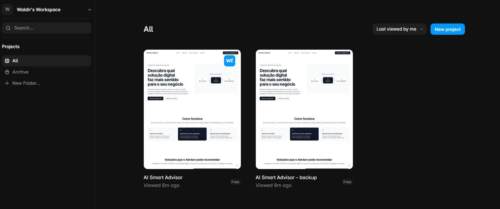

## Como testar

1. Acesse https://ai-smart-advisor.framer.ai
2. Clique em **Começar diagnóstico**.
3. Responda as cinco perguntas.
4. Confira a recomendação principal e a solução complementar.
5. Se desejar, escreva um pequeno contexto.
6. Clique em **Gerar análise com IA**.
7. Confira a orientação gerada.
8. Clique em **Solicitar uma análise**.
9. Preencha o formulário.
10. Marque o consentimento.
11. Envie a solicitação.

## Limitações

O projeto foi desenvolvido como atividade acadêmica e demonstração de portfólio.

A recomendação principal utiliza regras determinísticas definidas no projeto e não representa uma consultoria completa.

A análise com IA depende da disponibilidade da API utilizada e do Cloudflare Worker.

A chave da API utilizada durante a avaliação poderá ser revogada após o encerramento do período de avaliação acadêmica.

## Principais aprendizados

O projeto permitiu aplicar, na prática, a combinação entre uma plataforma no-code/low-code e desenvolvimento personalizado.

Durante o desenvolvimento foram trabalhados conceitos de responsividade, componentes, lógica com TypeScript, integração por API, IA generativa, segurança de credenciais, formulários, automação e acessibilidade.

Também ficou claro que ferramentas no-code aceleram a construção visual, mas conhecimentos de padrões Web permitem ampliar essas ferramentas quando existe necessidade de comportamento personalizado.

## Projeto acadêmico

**Universidade:** UniFECAF  
**Curso:** Graduação Tecnológica em Inteligência Artificial e Automação Digital  
**Disciplina:** Padrões Web Para No Code e Low Code  
**Aluno:** Waldir Adilson Évora dos Santos  
**RA:** 263388
